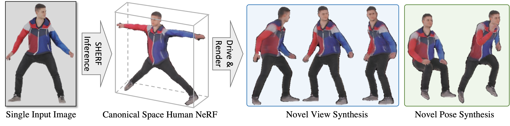

<div align="center">

<h1>SHERF: Generalizable Human NeRF from a Single Image</h1>

<div>
    <a href="https://skhu101.github.io" target="_blank">Shoukang Hu*<sup>1</sup></a>&emsp;
    <a href="https://hongfz16.github.io/" target="_blank">Fangzhou Hong*<sup>1</sup></a>&emsp;
    <a href="https://scholar.google.com/citations?user=lSDISOcAAAAJ" target="_blank">Liang Pan<sup>1</sup></a>&emsp;
    Haiyi Mei<sup>2</sup>&emsp;
    <a href="https://scholar.google.com.hk/citations?user=jZH2IPYAAAAJ&hl=en" target="_blank">Lei Yang<sup>2</sup></a>&emsp;
    <a href="https://liuziwei7.github.io/" target="_blank">Ziwei Liu</a>✉<sup>1</sup>&emsp;
</div>
<div>
    <sup>1</sup>S-Lab, Nanyang Technological University&emsp; <sup>2</sup>Sensetime Research
</div>
<div>
    <sup>*</sup>Equal Contribution&emsp; <sup>✉</sup>Corresponding Author
</div>
<div>
    ICCV 2023
</div>

<strong>SHERF learns a Generalizable Human NeRF to animate 3D humans from a single image.</strong>

<div style="width: 70%; text-align: center; margin:auto;">
    
    <em>Figure 1. <strong>SHERF is a single image-based generalizable Human NeRF.</strong> With just one inference pass on a single image, SHERF reconstructs Human NeRF in the canonical space which can be driven and rendered for novel view and pose synthesis.</em>
</div>

:open_book: For more visual results, go checkout our <a href="https://skhu101.github.io/SHERF" target="_blank">project page</a>

This repository will contain the official implementation of _SHERF: Generalizable Human NeRF from a Single Image_.

<div align="left">

## :mega: Updates
[08/2023] Training and inference codes for RenderPeople, THuman, HuMMan and ZJU-Mocap are released.

## :desktop_computer: Requirements
<!-- --- -->
NVIDIA GPUs are required for this project.
We recommend using anaconda to manage the python environments.

```bash
    conda create --name sherf python=3.8
    conda install pytorch==1.11.0 torchvision==0.12.0 torchaudio==0.11.0 cudatoolkit=11.3 -c pytorch
    conda install -c fvcore -c iopath -c conda-forge fvcore iopath
    conda install pytorch3d -c pytorch3d (or pip install --no-index --no-cache-dir pytorch3d -f https://dl.fbaipublicfiles.com/pytorch3d/packaging/wheels/py38_cu113_pyt1110/download.html)
    pip install -r requirements.txt
    conda activate sherf
```


## Set up Dataset
<!-- --- -->

#### RenderPeople Dataset
Please download our rendered multi-view images of RenderPeople dataset from [OneDrive](https://mycuhk-my.sharepoint.com/:f:/g/personal/1155098117_link_cuhk_edu_hk/ElL9IDDOaa5Hl785gvbqyEEB8ubdobyuMKqoDY3J85XStw?e=o2BUOt).

#### THuman Dataset

Please follow instructions of [MPS-NeRF](https://github.com/gaoxiangjun/MPS-NeRF) to download the [THuman](http://www.liuyebin.com/deephuman/deephuman.html) dataset. After that, please download our estimated [SMPL Neutral parameters](https://mycuhk-my.sharepoint.com/:u:/g/personal/1155098117_link_cuhk_edu_hk/ESgPK9M9zNxPr3dqEAoao4gBsomBTbAakC4c6eCpNxGGZA?e=i9wZni).

#### HuMMan Dataset

Please follow instructions of [HuMMan-Recon](https://caizhongang.github.io/projects/HuMMan/) to download the HuMMan dataset.

#### ZJU-Mocap dataset

Please follow instructions of [Neural Body](https://github.com/zju3dv/neuralbody) to download the ZJU-Mocap dataset.

Tips: If you hope to learn how to render multi-view images, You may refer to [XRFeitoria](https://github.com/openxrlab/xrfeitoria), a rendering toolbox for generating synthetic data photorealistic with ground-truth annotations.

## :running_woman: Inference

### Download Models

The pretrained models and SMPL model are needed for inference.

The pretrained models are put in [OneDrive](https://mycuhk-my.sharepoint.com/:u:/g/personal/1155098117_link_cuhk_edu_hk/EU3RxpLuKmZImkdJbG8Y12EBZ9RxIfQiEx7ctt5obXUjzw?e=gXJbIQ) and [Baidu Pan (pin:gu1q)](https://pan.baidu.com/s/1yqZd0L1zAoc-YUY4YCD4dQ) for downloading.

Register and download SMPL models [here](https://smpl.is.tue.mpg.de/). Put the downloaded models in the folder smpl_models. Only the neutral one is needed. The folder structure should look like

```
./
├── ...
└── assets/
    ├── SMPL_NEUTRAL.pkl
```

```bash
cd sherf
```

### Inference code with RenderPeople dataset
```bash
bash eval_renderpeople_512x512.sh
```

### Inference code with THuman dataset
```bash
bash eval_THuman_512x512.sh
```

### Inference code with HuMMan dataset
```bash
bash eval_HuMMan_640x360.sh
```

### Inference code with ZJU-Mocap dataset
```bash
bash eval_zju_mocap_512x512.sh
```

## :train: Training
<!-- --- -->

```bash
cd sherf
```

### Training code with RenderPeople dataset
```bash
bash train_renderpeople_512x512.sh
```

### Training code with THuman dataset
```bash
bash train_THuman_512x512.sh
```

### Training code with HuMMan dataset
```bash
bash train_HuMMan_640x360.sh
```

### Training code with ZJU_MoCap dataset
```bash
bash train_zju_mocap_512x512.sh
```

If you hope to evaluate the trained checkpoints, please add --test_flag True --resume CHECKPOINT.

## :love_you_gesture: Citation
<!-- --- -->

If you find the codes of this work or the associated ReSynth dataset helpful to your research, please consider citing:

```bibtex
@article{hu2023sherf,
  title={SHERF: Generalizable Human NeRF from a Single Image},
  author={Hu, Shoukang and Hong, Fangzhou and Pan, Liang and Mei, Haiyi and Yang, Lei and Liu, Ziwei},
  journal={arXiv preprint arXiv:2303.12791},
  year={2023}
}
```

## :newspaper_roll: License

Distributed under the S-Lab License. See `LICENSE` for more information.

## :raised_hands: Acknowledgements
This study is supported by the Ministry of Education, Singapore, under its MOE AcRF Tier 2 (MOE-T2EP20221-0012), NTU NAP, and under the RIE2020 Industry Alignment Fund – Industry Collaboration Projects (IAF-ICP) Funding Initiative, as well as cash and in-kind contribution from the industry partner(s).

This project is built on source codes shared by [EG3D](https://github.com/NVlabs/eg3d), [MPS-NeRF](https://github.com/gaoxiangjun/MPS-NeRF) and [Neural Body](https://github.com/zju3dv/neuralbody).